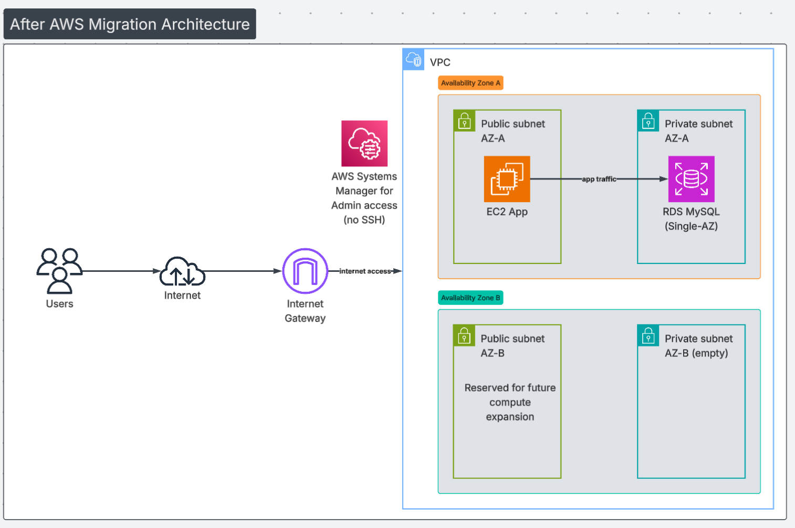
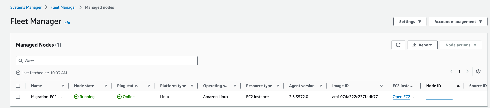
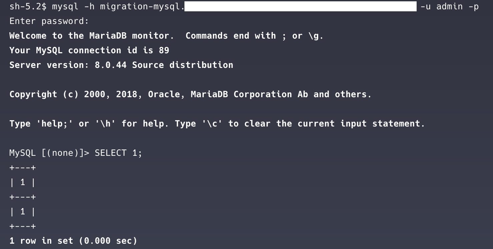
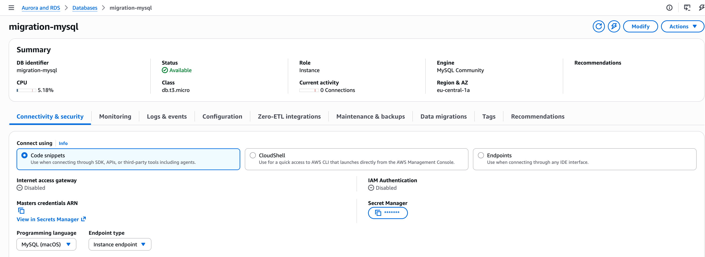

# Terraform AWS Migration — From On-Prem to Cloud

## Project overview

This project demonstrates how a manually configured internal backend running on physical servers can be migrated to AWS using **Terraform**, with a focus on **repeatability, security boundaries, and explicit architectural decisions**.

The goal was **not** to modernize the application or build a production-scale platform, but to:
- make the infrastructure reproducible
- remove manual configuration drift
- document decisions and trade-offs clearly

This is intentionally a **small, focused project**.

---

## Problem statement

The original backend was deployed on **on-premises physical servers** and configured manually:
- application server and database tightly coupled
- no Infrastructure as Code
- difficult to reproduce environments
- recovery and changes required manual intervention

As the system evolved, this setup became fragile and hard to reason about.

---

## Architecture

### Before migration (on-premises)

The original setup consisted of manually configured physical servers behind a company network edge.

- No Infrastructure as Code
- Application and database tightly coupled
- Changes and recovery required manual intervention


---

### After migration (AWS + Terraform)

The backend was re-created on AWS using Terraform with clear network boundaries and explicit security rules.

Key characteristics:
- Custom VPC with public and private subnets
- EC2 used as application entry point
- RDS MySQL isolated in private subnets
- Administrative access handled via AWS Systems Manager (no SSH)
- Infrastructure fully reproducible using IaC



---

## What this project demonstrates

- Recreating infrastructure reliably using Terraform
- Designing clear public vs private network boundaries
- Using security group references instead of IP-based rules
- Avoiding unnecessary services to keep scope and cost low
- Making trade-offs explicit instead of hiding them

---

## Key design decisions (summary)

- **Custom VPC**  
  Used instead of the default VPC to explicitly control subnetting, routing, and isolation.

- **Public EC2, private RDS**  
  Application runs in a public subnet; database is never publicly accessible.

- **Single-AZ RDS**  
  Chosen to keep cost and complexity low. Multi-AZ is a clear next hardening step.

- **SSM instead of SSH**  
  No inbound management ports. Administrative access is IAM-based via Systems Manager.

- **No ALB, ASG, or NAT Gateway**  
  Intentionally excluded to avoid over-engineering and recurring costs.

---

## Security model

- **EC2 security group**
  - no inbound rules
  - outbound HTTPS (SSM)
  - outbound MySQL only to the RDS security group

- **RDS security group**
  - inbound MySQL (3306) **only** from the EC2 security group
  - no public access

**Secrets management**
- RDS credentials are generated and managed by AWS
- Stored in **AWS Secrets Manager**
- Terraform does not store database passwords in state or outputs

---

## Validation and evidence

The infrastructure was validated end-to-end using the AWS Console and CLI.

### EC2 managed via Systems Manager

The EC2 instance successfully registers as a managed node and is reachable without SSH.



---

### Security groups — no inbound access

The EC2 security group has no inbound rules; all access is outbound-initiated.


---

### EC2 → RDS connectivity

Connectivity from the EC2 instance to the private RDS endpoint was verified via an SSM session.

Inside the SSM session:
```sql
SELECT 1;
```

Successful output confirms:
- VPC routing
- security group rules
- database accessibility from the application tier



---

### RDS is not publicly accessible

The RDS instance is deployed in private subnets with public access disabled.



---

## Troubleshooting approach

If `terraform apply` or runtime connectivity fails, I troubleshoot in this order:

1. Read the exact error message
2. Identify which resource failed
3. Verify dependencies (subnets, route tables, security groups)
4. Check AWS service-side constraints (IAM, RDS subnet groups, engine settings)
5. Review AWS Console events for the failing resource
6. Fix the smallest possible issue and re-apply

This avoids blind retries and large refactors during debugging.

---

## Scope limitations (intentional)

This project intentionally does **not** include:
- Auto Scaling Groups
- Load balancers
- NAT Gateways
- Multi-region deployment
- Application-level changes

The focus is **infrastructure clarity and reasoning**, not feature completeness.

---

## Closing note

This project reflects how I currently think about cloud infrastructure:
- start small
- make trade-offs explicit
- prefer clarity over complexity
- use managed services where they reduce operational risk

Future projects will build on this foundation with cost controls, observability, and automation.
